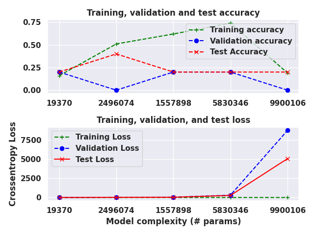

# MLCurves
A lightweight python module to generate training curves for analysis during model development
`Tested with python>=3.8`

## Installation
```{bash}
git clone https://github.com/ifrit98/mlcurves.git
cd mlcurves && pip install .
```

## Useful tools and submodules
### Clustering
Clustering can be done using the cluster submodule, accessed through `mlcurves.cluster`.

Clutsering algorithms available:
- `mlcurves.cluster.tsne`
- `mlcurves.cluster.pca`
- `mlcurves.cluster.pca_then_tsne` # compute PCA reduction then visualize using T-SNE

### Cluster with T-SNE
```{python}
import mlcurves as mc

x_train, y_train = data[...], data[...]

transform = mc.cluster.tsne(
    x_train,        # can be n-dimensional floating point data
    y_train,        # must be list or array of integers
    perplexity=30,  # default=50 
    n_components=2, # number of TSNE components (default=2)
    n_iter=300,     # default=2000
    scale=True,     # default=False
    scale_type='standard'
)
```


### Cluster with PCA first to reduce dimensionality, then apply T-SNE for visualization
```{python}
import mlcurves as mc

x_train, y_train = data[...], data[...]

transform = mc.cluster.pca_then_tsne(
    x_train,             # can be n-dimensional floating point data
    y_train,             # must be list or array of integers
    perplexity=30,       # (default=50)
    whiten=True,         # whitens data (default=False)
    n_tsne_components=2, # Components for TSNE visualization
    n_pca_components=50, # Number of components for PCA reduction
    n_iter=300,          # default=2000
    scale=True,          # default=False
    scale_type='standard'
)
```


## Training Curve routines available
- `mlcurves.generate_train_set_size_curves_npy`
- `mlcurves.generate_train_set_size_curves_tf`
- `mlcurves.complexity_curves_tf`
- `mlcurves.complexity_curves_npy`
- `mlcurves.regularization_curves` # NotYetImplemented Error

### Training Size Curves
```{python}
import mlcurves as mc
import tensorflow_datasets as tfds

# For tensorflow datasets
ds, ts = tfds.load('mnist', split=['train', 'test'], shuffle_files=True)

ds = ds.map(lambda x: (tf.reshape(x['image'], [-1]), x['label']))
ts = ts.map(lambda x: (tf.reshape(x['image'], [-1]), x['label']))

batch_size=32
n_runs=11
epochs=10

val_size = 1500
trainset = ds.skip(val_size)
valset = ds.take(val_size)
testset = ts

mc.generate_train_set_size_curves_tf(
    model_fn=build_antirectifier_model,                 # callable model function, a returns tf.keras.Model object
    trainset=trainset, valset=valset, testset=testset,  # tf.data.Dataset objects
    batch_size=batch_size, n_runs=n_runs, epochs=epochs # training params
)

...

# For numpy arrays
trainXy = np.asarray(list(ds.as_numpy_iterator()))
testXy = np.asarray(list(ts.as_numpy_iterator()))
X = np.concatenate([trainXy, testXy])
y = X[:, 1]
X = X[:, 0]

mc.generate_train_set_size_curves_npy(
    model_fn=build_antirectifier_model, # model function (callable)
    X=X, y=y, # data sources
    epochs=epochs, 
    batch_size=batch_size, 
    n_runs=n_runs # number of runs to perform (slices data int `n_run` chunks of increasing size)
)
```


### Complexity Curves (complete example below)
Complexity curves are generated by taking a callable `model_fn` that returns a built and compiled `tf.keras`: `Sequential` or `Model` object, configured by `configs`, a list of dictionaries, each of which contain parameters to `model_fn` usually in inceasing complexity (# model parameters).

```{python}
from mlcurves import models, complexity_curves

# You can use hard-coded config dicts for each of the three models in the `models` submodule e.g.:
models.antirectifier.configs
>>> Out[44]:
{'antirect_tiny': {'n_layers': 2,
  'filter_sizes': [32, 64],
  'kernel_sizes': [3, 3],
  'dropout_rate': 0.2,
  'penultimate_units': 32,
  'flatten': False,
  'padding': 'same',
  'logits': True},
...
'antirect_xlarge': {'n_layers': 10,
  'filter_sizes': [64, 64, 128, 128, 256, 256, 384, 384, 512, 512],
  'kernel_sizes': [3, 3, 5, 5, 7, 7, 9, 10, 10, 10],
  'dropout_rate': 0.2,
  'penultimate_units': 256,
  'flatten': False,
  'padding': 'same',
  'logits': True}}
```

If writing your own list of config dicts, follow this convention:
```
config_a = {
    '<model_config_name_1>': dict(
        '<arg_1>': <var_1>,
        '<arg_2>': <var_2>,
        ...,
        '<arg_n>': <var_n>,        
    ),
}
...
config_n = {
    '<model_config_name_2>': dict(
        '<arg_1>': <var_1>,
        '<arg_2>': <var_2>,
        ...,
        '<arg_n>': <var_n>,        
    ),
}

config_list = [config_a, ..., config_n]

# This is what will be passed to `complexity_curves()`
config_dict = dict(zip(range(len(configs), config_list)
```

Complete example:
```{python}
import tensorflow as tf
import tensorflow_datasets as tfds
from mlcurves.models import antirectifier
from mlcurves import complexity_curves_tf

# Prepare tensorflow datasets
batch_size=32
epochs=10
val_size=1500
num_classes=10
input_shape=None

ds, ts = tfds.load('mnist', split=['train', 'test'], shuffle_files=True)
ds = ds.map(lambda x: (tf.reshape(x['image'], [-1]), x['label']))
ts = ts.map(lambda x: (tf.reshape(x['image'], [-1]), x['label']))
ds = ds.skip(val_size)
vs = ds.take(val_size)


# Prepare model and configuration
model_fn = antirectifier.build_antirectifier_cnn_1D
configs = antirectifier.configs  # hard-coded configuration dict of (int, dict) dict pairs

history = complexity_curves_tf(
    model_fn=model_fn, # model function (callable)
    train_ds=ds,       # training data (tf.data.Dataset)
    val_ds=vs,         # validation data (tf.data.Dataset)
    test_ds=ts,        # test data (tf.data.Dataset)
    configs,           # dict: configurations for each run, usually with increasing parameter count.
    epochs=10,         # int: epochs for each sub run
    batch_size=16,     # int: how many examples per batch
    input_shape=None,  # (tuple), [list]: if known, enter expected input shape, e.g. (x,..., c)
    num_classes=None,  # int: number of classes 
    outpath='./plot'   # str: where to dump output images
)
```

